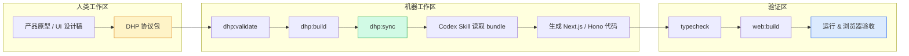
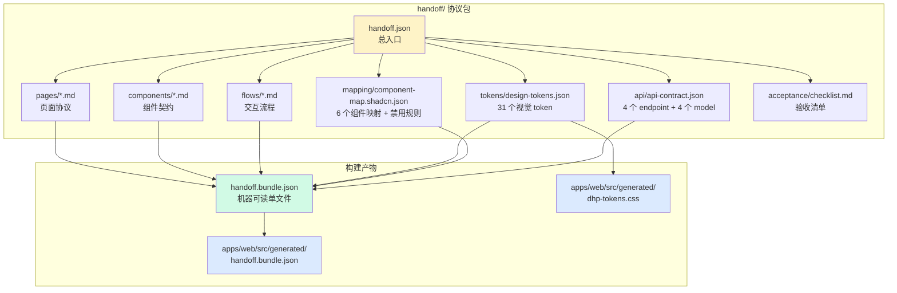
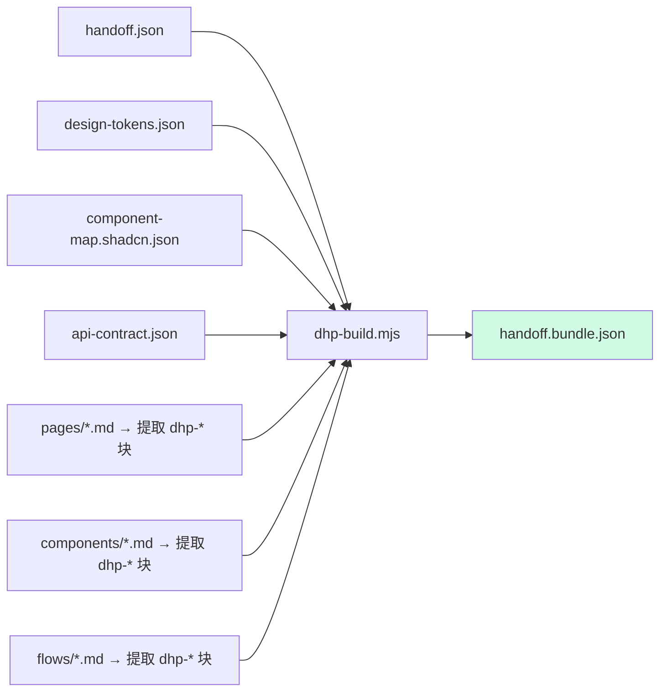
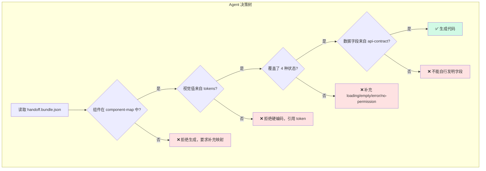
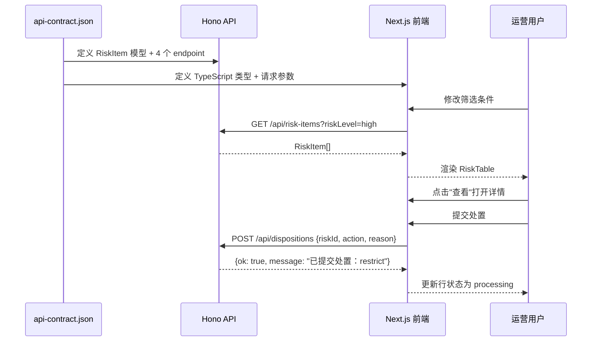
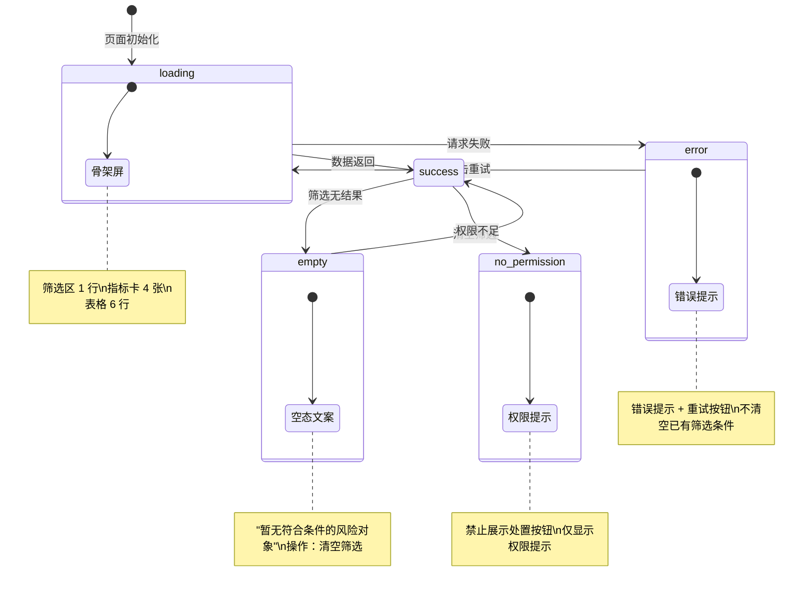
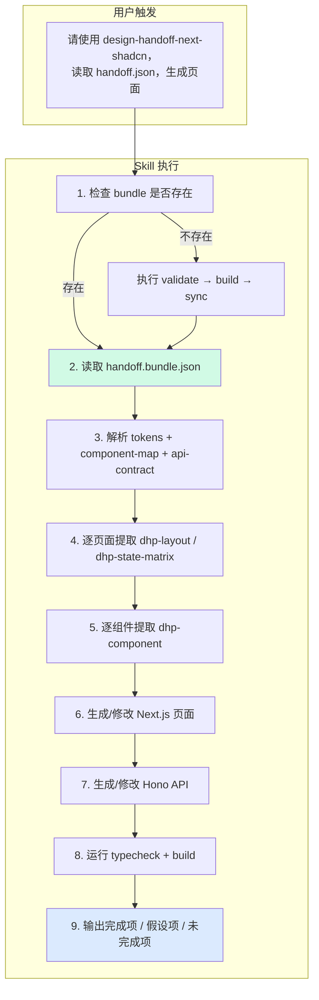

# DHP 功能演示与流程图

## 一、核心理念：为什么需要 DHP

```
传统流程（Agent 不稳定）：
  设计截图 → Agent 看图猜 UI → 不可控的代码

DHP 流程（Agent 可约束）：
  设计意图 → 结构化协议 → 校验通过 → Agent 按约束生成 → 可验证的代码
```

DHP 不是让 Agent "更聪明"，而是让 Agent "更受控"。

---

## 二、整体架构



---

## 三、协议包结构与数据流



---

## 四、校验 → 构建 → 同步 三步流水线

### Step 1: `npm run dhp:validate`

校验器检查协议完整性，任何缺失都会报错中断：

```
检查项                          规则
─────────────────────────────────────────────────
handoff.json 必填字段           dhpVersion, module, targetStack, tokens,
                                componentMap, pages
design-tokens.json              至少 8 个 token，不允许空值
component-map.shadcn.json       必须有 uiLibrary 和 components
pages/*.md                      每个页面必须有 dhp-layout + dhp-state-matrix
components/*.md                 每个组件必须有 dhp-component
```

实际输出：

```
DHP validate passed: handoff
- module: merchant-risk-console
- pages: 1
- components: 5
- tokens: 31
```

### Step 2: `npm run dhp:build`

把分散的协议文件打包成单个 `handoff.bundle.json`：



### Step 3: `npm run dhp:sync`

同步到 Next.js 应用的 `src/generated/` 目录：

- 复制 `handoff.bundle.json` → 前端可 import
- 从 tokens 生成 `dhp-tokens.css`（31 个 CSS 变量）

生成的 CSS 变量示例：

```css
:root {
  --dhp-color-background: #F8FAFC;
  --dhp-color-primary: #2563EB;
  --dhp-color-danger: #DC2626;
  --dhp-spacing-lg: 16px;
  --dhp-radius-md: 10px;
  --dhp-shadow-card: 0 1px 2px rgba(15, 23, 42, 0.06);
  /* ... 共 31 个 */
}
```

---

## 五、Agent 约束模型



Agent 的 5 条硬约束：

| # | 约束 | 违反后果 |
|---|------|---------|
| 1 | 只能用 component-map 中声明的组件 | 拒绝生成 |
| 2 | 视觉值必须来自 tokens | 拒绝硬编码 |
| 3 | 每个页面必须覆盖 loading/empty/error/no-permission | 补充后才能继续 |
| 4 | 数据字段必须来自 api-contract | 不能自行发明 |
| 5 | 缺失信息必须显式写假设 | 不允许静默补全 |

---

## 六、示例：从协议到代码的完整映射

### 协议侧（FilterPanel 组件契约）

```json
{
  "name": "FilterPanel",
  "implementedBy": ["Card", "Input", "Select", "Button"],
  "fields": [
    {"name": "keyword", "label": "商户/风险ID", "component": "Input"},
    {"name": "riskLevel", "label": "风险等级", "component": "Select"},
    {"name": "source", "label": "风险来源", "component": "Select"},
    {"name": "dateRange", "label": "时间范围", "component": "Select"}
  ],
  "states": ["idle", "loading", "error"]
}
```

### 代码侧（生成的 React 组件）

```tsx
function FilterPanel({ query, setQuery, loading }) {
  return (
    <Card>
      <CardContent>
        <div className="grid gap-3 md:grid-cols-4">
          <label>商户/风险ID
            <Input disabled={loading} value={query.keyword} />
          </label>
          <label>风险等级
            <Select disabled={loading} value={query.riskLevel}>...</Select>
          </label>
          <label>风险来源
            <Select disabled={loading} value={query.source}>...</Select>
          </label>
          <label>时间范围
            <Select disabled={loading} value={query.dateRange}>...</Select>
          </label>
        </div>
        <Button disabled={loading}>{loading ? "查询中…" : "查询"}</Button>
      </CardContent>
    </Card>
  );
}
```

映射关系：
- `implementedBy: ["Card", "Input", "Select", "Button"]` → 只用了这 4 个 shadcn/ui 组件
- `fields[].component` → 直接对应 JSX 元素
- `states: ["loading"]` → `disabled={loading}` + 按钮文案切换

---

## 七、前后端数据契约联动



API 契约定义的 4 个数据模型：

```
RiskItem      → 风险对象（表格行）
Metric        → 指标卡数据
RiskQuery     → 筛选参数
DispositionRequest → 处置请求体
```

---

## 八、状态矩阵演示

页面协议中定义的 5 种状态，前端必须全部实现：



前端实现中，用户可以通过顶部按钮切换 5 种状态来验证覆盖度。

---

## 九、Codex Skill 执行流程



---

## 十、一键验证命令

```bash
# 最小验证（无需 npm install）
npm run verify:offline

# 完整验证
npm install
npm run typecheck
npm run web:build
npm run api:hono:build
```

验证通过意味着：
- 协议格式正确
- Bundle 可构建
- TypeScript 类型安全
- Next.js 生产构建成功
- Hono API 可编译

---

## 十一、项目运行效果

启动后访问 `http://localhost:3000`，可以看到：

1. 顶部标题栏：显示 DHP Bundle 版本和模块名
2. 状态切换按钮：success / loading / empty / error / no-permission
3. 筛选区：4 个字段（商户ID、风险等级、风险来源、时间范围）
4. 指标卡：4 张（总风险数、高危占比、待处理、本周新增）
5. 风险列表：Table + Badge + 操作按钮
6. 详情抽屉：Sheet 侧滑，展示详情 + 处置表单
7. 协议摘要：展示 bundle 中的页面/组件/流程数量

每个 UI 区块都严格对应协议中的一个 `dhp-component`，没有任何"自由发挥"的部分。
