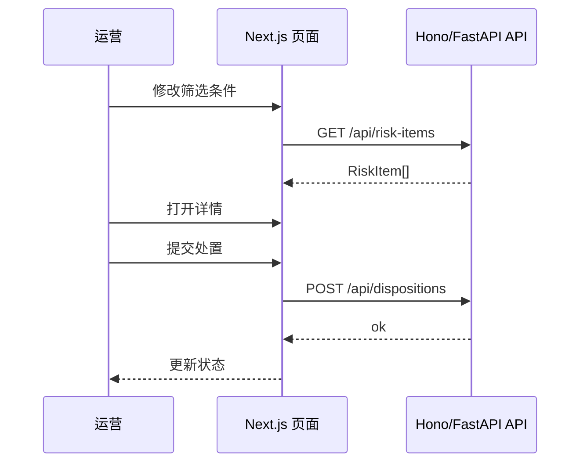

# 筛选与处置流程



```dhp-interaction
{
  "flowId": "filter-and-dispose",
  "steps": [
    {"step": 1, "actor": "user", "action": "修改筛选条件"},
    {"step": 2, "actor": "ui", "action": "调用 GET /api/risk-items", "state": "loading"},
    {"step": 3, "actor": "ui", "action": "渲染 RiskTable", "state": "success | empty | error"},
    {"step": 4, "actor": "user", "action": "打开详情抽屉"},
    {"step": 5, "actor": "user", "action": "提交处置", "permission": "risk.write"},
    {"step": 6, "actor": "ui", "action": "刷新当前行状态"}
  ]
}
```
