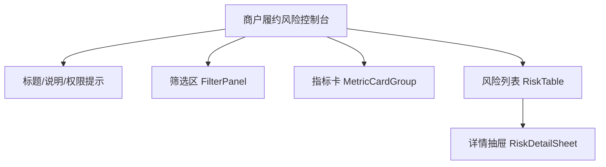

# 商户履约风险控制台

## 页面目标

帮助运营识别高风险商户，筛选风险来源，查看风险原因，并对风险对象执行处置动作。

## Markdown 线框



```dhp-layout
{
  "pageId": "merchant-risk-dashboard",
  "route": "/",
  "title": "商户履约风险控制台",
  "layout": {
    "type": "PageShell",
    "tokens": {
      "padding": "spacing.xl",
      "gap": "spacing.lg",
      "background": "color.background"
    },
    "children": [
      {"id": "header", "component": "PageHeader", "height": "auto"},
      {"id": "filter", "component": "FilterPanel", "columns": 4},
      {"id": "metrics", "component": "MetricCardGroup", "columns": {"desktop": 4, "tablet": 2, "mobile": 1}},
      {"id": "riskTable", "component": "RiskTable", "minWidth": 960},
      {"id": "detail", "component": "RiskDetailSheet", "width": 520}
    ]
  }
}
```

```dhp-binding
{
  "dataSources": {
    "metrics": "GET /api/risk-items -> derive metrics",
    "riskItems": "GET /api/risk-items",
    "handoff": "GET /api/handoff"
  },
  "fields": {
    "RiskTable.id": "RiskItem.id",
    "RiskTable.merchantName": "RiskItem.merchantName",
    "RiskTable.riskLevel": "RiskItem.riskLevel",
    "RiskTable.riskTags": "RiskItem.riskTags",
    "RiskTable.fulfillmentScore": "RiskItem.fulfillmentScore",
    "RiskTable.source": "RiskItem.source",
    "RiskTable.updatedAt": "RiskItem.updatedAt",
    "RiskTable.status": "RiskItem.status"
  }
}
```

```dhp-state-matrix
{
  "states": [
    {"name": "loading", "scope": "page", "ui": "骨架屏：筛选区 1 行，指标卡 4 张，表格 6 行"},
    {"name": "empty", "scope": "RiskTable", "ui": "空态文案：暂无符合条件的风险对象；操作：清空筛选"},
    {"name": "error", "scope": "page", "ui": "错误提示 + 重试按钮，不清空已有筛选条件"},
    {"name": "no-permission", "scope": "RiskDetailSheet", "ui": "禁止展示处置按钮，仅显示权限提示"},
    {"name": "success", "scope": "page", "ui": "展示真实列表和可执行操作"}
  ]
}
```

```dhp-interaction
{
  "interactions": [
    {
      "id": "filter-submit",
      "trigger": "点击 查询 或修改筛选项后 debounce 300ms",
      "precondition": "用户拥有 risk.read 权限",
      "effect": "刷新 RiskTable 数据并重算 MetricCardGroup",
      "failure": "进入 error 状态，保留上一次成功数据"
    },
    {
      "id": "open-detail",
      "trigger": "点击表格行或 查看 按钮",
      "effect": "打开 RiskDetailSheet，展示当前 RiskItem 详情"
    },
    {
      "id": "dispose-risk",
      "trigger": "在详情抽屉点击 处置",
      "precondition": "用户拥有 risk.write 权限",
      "effect": "POST /api/dispositions，成功后更新行状态为 processing"
    }
  ]
}
```

```dhp-responsive
{
  "breakpoints": {
    "desktop": ">= 1280px",
    "tablet": "768px - 1279px",
    "mobile": "< 768px"
  },
  "rules": [
    {"target": "FilterPanel", "mobile": "垂直堆叠，查询按钮占满宽度"},
    {"target": "MetricCardGroup", "tablet": "2 列", "mobile": "1 列"},
    {"target": "RiskTable", "mobile": "保留关键列：商户、风险等级、状态、操作"},
    {"target": "RiskDetailSheet", "mobile": "宽度 100vw"}
  ]
}
```
