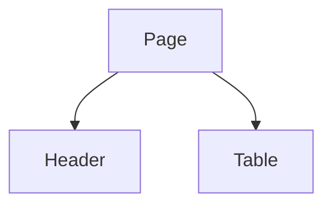

# DHP 协议说明

DHP 使用 Markdown 作为人类可读容器，使用 `dhp-*` JSON 代码块作为 Agent 可执行协议。

## 最小页面协议

```md
# 页面名称

## 页面目标
...



```dhp-layout
{
  "pageId": "example",
  "layout": {
    "type": "page",
    "children": []
  }
}
```
```

## Agent 解释优先级

1. JSON 协议块
2. tokens
3. component-map
4. API contract
5. 普通 Markdown 说明
6. Mermaid 线框
